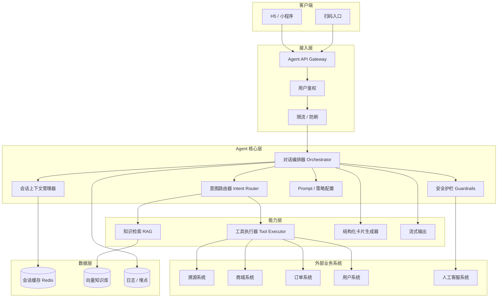
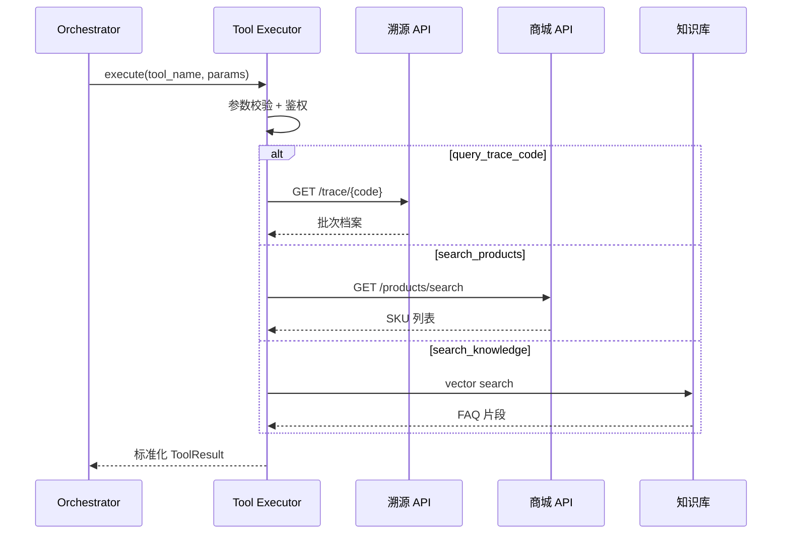
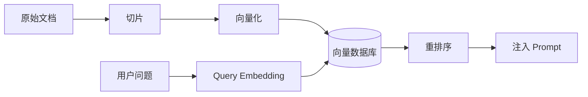
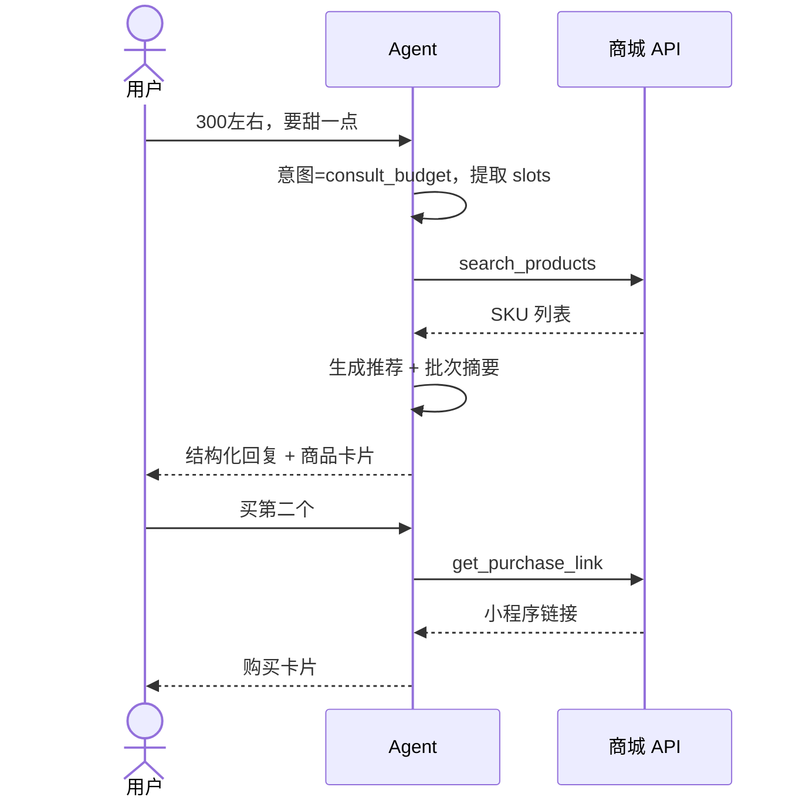
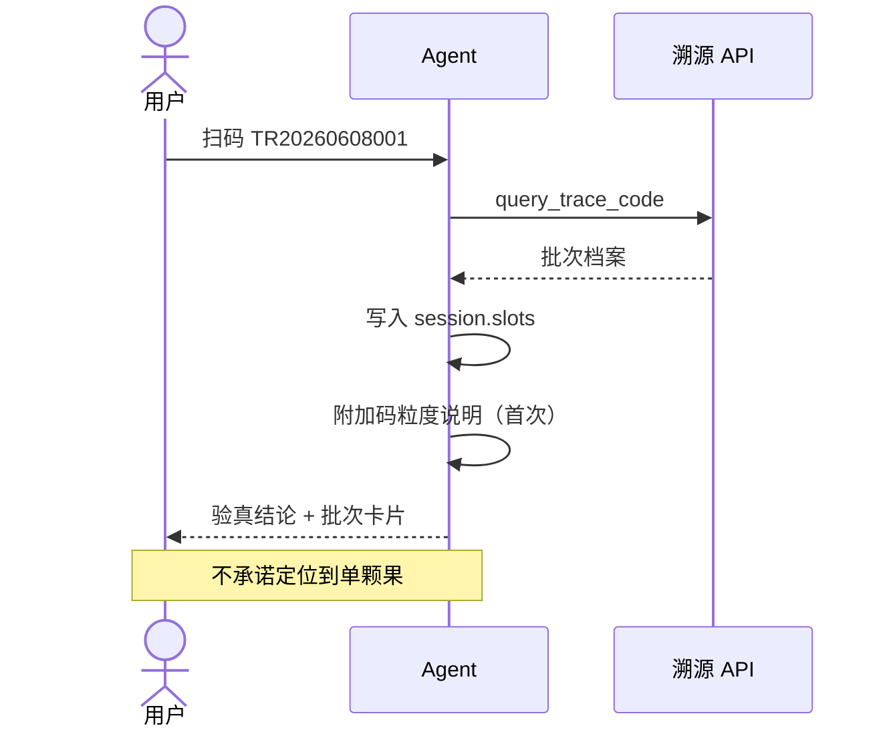
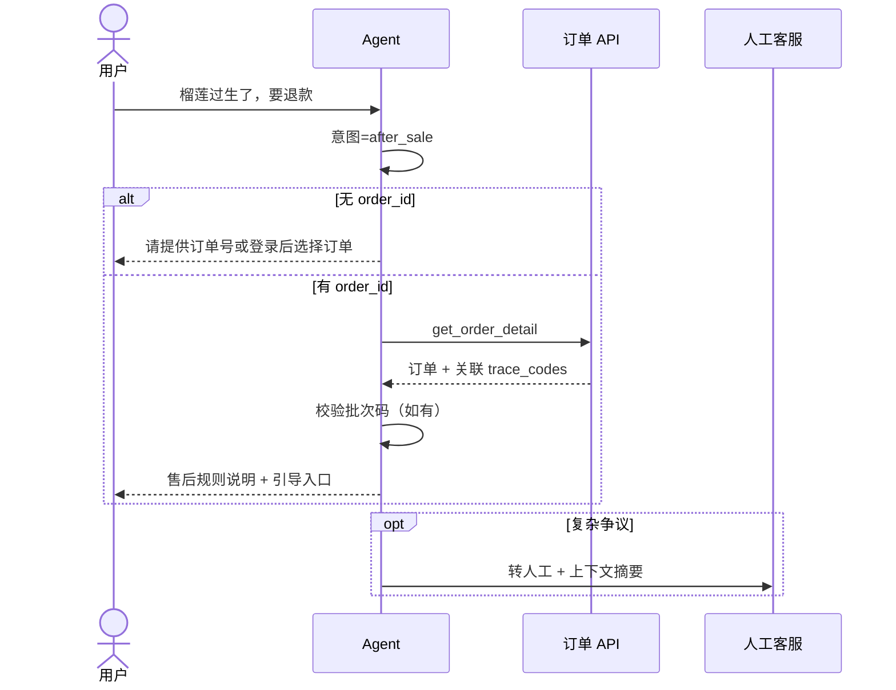
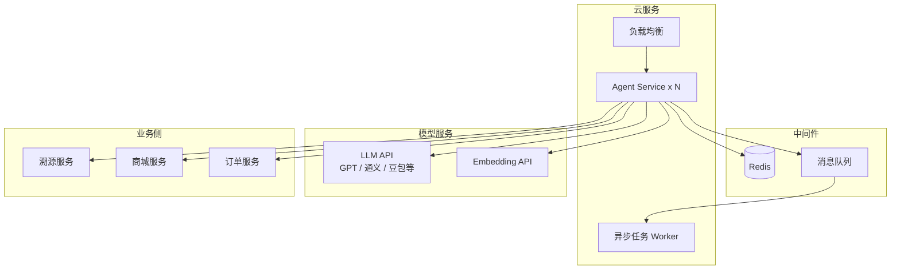

# 榴莲 Agent 技术架构文档

| 项目 | 内容 |
|------|------|
| 关联 PRD | `PRD-榴莲Agent.md` v1.1 |
| 文档版本 | v1.0 |
| 更新日期 | 2026-06-10 |
| 溯源模式 | 一批一品类一码 |

---

## 1. 架构总览

榴莲 Agent 采用 **「对话编排 + 意图路由 + 工具调用 + 知识检索」** 的 LLM Agent 架构，通过工具层对接溯源、商城、订单等存量系统，不替代业务系统，只做智能编排与可信表达。



---

## 2. 设计原则

| 原则 | 说明 |
|------|------|
| **工具即真相** | 价格、库存、批次信息必须来自工具返回，LLM 不得编造 |
| **批次码非单果码** | 架构层固化话术与卡片约束，防止粒度误解 |
| **订单优先于溯源码** | 售后、购后定位以 `order_id` 为主，`trace_code` 辅助 |
| **先咨询后转化** | 推荐商品是咨询结论的延伸，非默认首响应 |
| **可观测可降级** | 工具失败有兜底话术；核心路径可切纯 FAQ 模式 |

---

## 3. Agent 核心层

### 3.1 对话编排器（Orchestrator）

职责：单轮/多轮对话的总控，协调路由、工具、RAG、卡片生成。

```
用户输入
  → 上下文加载（session + user）
  → 意图识别（Router）
  → 决策：直接回答 / 调工具 / 检索知识库 / 转人工
  → 工具并行或串行执行
  → 结果汇总 + 护栏校验
  → 结构化回复 + 卡片
  → 流式输出 + 埋点
```

**MVP 建议**：单 Agent + 规则路由，不做多 Agent 协作，降低复杂度。

### 3.2 意图路由器（Intent Router）

| 意图 | 触发示例 | 主要工具 / 能力 | 优先级 |
|------|----------|-----------------|--------|
| `consult_variety` | 「猫山王和金枕哪个甜？」 | `search_knowledge`, `search_products` | P0 |
| `consult_budget` | 「300 左右推荐」 | `search_products` | P0 |
| `trace_query` | 扫码 / 输入溯源码 | `query_trace_code` | P0 |
| `purchase_intent` | 「想买」「有货吗」「链接」 | `search_products`, `get_purchase_link` | P0 |
| `after_sale` | 「过生了」「退款」 | `get_order_detail`, 转人工 | P0 |
| `post_purchase` | 「怎么开」「怎么保存」 | `search_knowledge`, `query_trace_code` | P0 |
| `image_analyze` | 上传图片 | `analyze_durian_image` | P1 |
| `chitchat` | 闲聊 | `search_knowledge` / 边界回复 | P0 |
| `human_handoff` | 投诉 / 识别失败 | 客服系统 | P0 |

路由实现（MVP）：

```
规则优先（关键词、扫码事件、订单号格式）
  ↓ 未命中
LLM 轻量分类（JSON 输出 intent + slots）
  ↓
槽位填充：budget, variety, trace_code, order_id, taste_tags
```

### 3.3 会话上下文管理器

存储于 Redis，TTL 建议 24h（可配置）。

```json
{
  "session_id": "sess_xxx",
  "user_id": "u_123",
  "turn_count": 5,
  "current_intent": "purchase_intent",
  "slots": {
    "budget": [200, 350],
    "variety": "金枕",
    "taste_tags": ["偏甜", "气味适中"],
    "trace_code": "TR20260608001",
    "batch_id": "BATCH_8891",
    "order_id": null
  },
  "shown_trace_tip": true,
  "recommended_products": ["sku_101", "sku_102"],
  "messages_summary": "用户预算300，偏好金枕，已查批次码 TR..."
}
```

**关键规则**：
- 扫码后自动写入 `trace_code` + `batch_id`
- 售后意图且缺 `order_id` 时，编排器插入追问，不直接调售后工具
- `shown_trace_tip` 控制码粒度说明仅首次展示

### 3.4 安全护栏（Guardrails）

| 护栏类型 | 检查点 | 动作 |
|----------|--------|------|
| 事实校验 | 回复前 | 含价格/库存/批次字段必须有工具 source |
| 码粒度 | 溯源相关回复 | 强制附加批次码说明模板 |
| 合规 | 输出前 | 拦截医疗功效、绝对化用语 |
| 工具失败 | 工具异常 | 替换为兜底话术，不 hallucinate |
| 转人工 | 连续 2 轮无法理解 / 情绪激动 / 理赔争议 | 触发 `human_handoff` |

---

## 4. 工具层架构

### 4.1 工具注册与执行



### 4.2 工具接口规范（MVP）

所有工具返回统一结构：

```json
{
  "success": true,
  "source": "trace_service",
  "data": { },
  "error_code": null,
  "latency_ms": 120
}
```

#### P0 工具定义

**`query_trace_code`**

```
输入:  { "trace_code": "TR20260608001" }
输出:  {
  "valid": true,
  "batch_id": "BATCH_8891",
  "variety": "猫山王",
  "grade": "A",
  "origin": "马来西亚彭亨",
  "pick_date": "2026-06-06",
  "stock_in_date": "2026-06-08",
  "weight_range": "3-4斤",
  "ripeness_range": "75%-85%",
  "batch_status": "on_sale",
  "listing_ids": ["sku_201"]
}
```

**`search_products`**

```
输入:  { "variety": "金枕", "price_min": 200, "price_max": 350, "taste_tags": ["偏甜"] }
输出:  { "items": [{ "product_id", "name", "price", "stock", "batch_summary" }] }
```

**`get_product_detail`**

```
输入:  { "product_id": "sku_201" }
输出:  { "product_id", "price", "stock", "ship_time", "batch_summary", "trace_code" }
```

**`get_purchase_link`**

```
输入:  { "product_id": "sku_201", "channel": "wechat_mini" }
输出:  { "url", "card_params": { "title", "price", "image" } }
```

**`search_knowledge`**

```
输入:  { "query": "榴莲能和酒一起吃吗" }
输出:  { "chunks": [{ "content", "source", "score" }] }
```

**`get_order_detail`**

```
输入:  { "order_id": "ORD_123", "user_id": "u_123" }
输出:  { "order_id", "status", "items", "trace_codes": ["TR..."], "created_at" }
```

### 4.3 工具调用策略

| 场景 | 调用顺序 | 说明 |
|------|----------|------|
| 咨询购买 | `search_knowledge` → `search_products` | 先科普再推荐 |
| 扫码验真 | `query_trace_code` | 单次调用 |
| 扫码后想买 | `query_trace_code` → `get_product_detail` → `get_purchase_link` | 基于 listing_ids |
| 售后 | `get_order_detail` →（P1）`create_after_sale_ticket` | 必须先有 order_id |
| 到货开果 | `query_trace_code` + `search_knowledge` | 批次区间 + 通用指南 |

MVP 限制单轮最多 **3 次**工具调用，防止延迟过高。

---

## 5. 知识库（RAG）架构



### 5.1 知识来源

| 类型 | 内容 | 更新频率 |
|------|------|----------|
| 品种百科 | 猫山王、金枕、干尧等 | 低 |
| 食用指南 | 保存、开果、禁忌 | 低 |
| 售后政策 | 赔付规则、时效 | 中 |
| 运营话术 | 批次码说明、常见问题 | 中 |
| 商品说明 | SKU 描述（非价格库存） | 高 |

**注意**：价格、库存、批次状态 **不走 RAG**，必须走工具。

### 5.2 检索策略

- Top-K = 5，相似度阈值 ≥ 0.75
- 无命中 → 通用边界回复 + 建议转人工
- 命中低分 → 标注「以下信息供参考」

---

## 6. Prompt 架构

采用 **分层 Prompt**：System + Intent + Tool Result + Output Format。

### 6.1 System Prompt 核心约束（摘要）

```
你是榴莲可信选购助手，帮助用户选购、批次验真、购后咨询。

硬性规则：
1. 价格、库存、批次信息只能引用工具返回，不得编造。
2. 溯源码代表「批次+品类」，不是单果唯一码；涉及溯源时必须说明。
3. 售后定位以订单号为主；无订单号时主动追问。
4. 先给专业建议，再推荐商品；单次推荐不超过 3 个 SKU。
5. 无法确认时明确告知，不猜测。
```

### 6.2 输出格式约束

```json
{
  "reply_text": "自然语言回复",
  "conclusion": "可以买 | 再等等 | 不建议 | 需验批次",
  "reasons": ["...", "...", "..."],
  "next_action": "扫码验真 | 查看商品 | 提供订单号 | 联系客服",
  "cards": [
    { "type": "trace_batch", "payload": {} },
    { "type": "product_recommend", "payload": {} }
  ]
}
```

前端优先渲染 `cards`；`reply_text` 流式输出。

---

## 7. 关键链路时序

### 7.1 咨询 → 推荐 → 购买



### 7.2 扫码验真（一批一品类一码）



### 7.3 售后



---

## 8. 部署架构（MVP）



### 8.1 服务拆分建议

| 服务 | 职责 | MVP 是否独立部署 |
|------|------|------------------|
| `agent-api` | 对话入口、流式 SSE | 是 |
| `agent-core` | 编排、路由、Prompt | 可与 api 合并 |
| `tool-adapter` | 对接外部 API | 可与 core 合并 |
| `knowledge-service` | RAG 检索 | 可合并，知识量少时 |
| `admin-console` | 话术、质检、漏斗 | P1 |

MVP 建议 **1~2 个后端服务** 即可，避免过度拆分。

### 8.2 技术选型参考

| 组件 | 推荐 |
|------|------|
| 后端 | Python FastAPI / Node.js NestJS |
| 向量库 | pgvector / Milvus / 云向量库 |
| 缓存 | Redis |
| 模型 | 主模型 + 小模型做意图分类（可选） |
| 前端 | 微信小程序 + H5 对话组件 |

---

## 9. 可观测性

| 类型 | 内容 |
|------|------|
| 链路追踪 | `trace_id` 贯穿 API → 工具 → LLM |
| 核心指标 | 首字延迟、工具成功率、意图命中率、转人工率 |
| 业务漏斗 | 咨询 → 扫码 → 商品曝光 → 点击 → 下单 |
| 质检采样 | 对话全量存档，每日抽检 5% |

日志脱敏：`user_id` 可记录，手机号中间四位打码。

---

## 10. 与 PRD 功能映射

| PRD 模块 | 架构组件 |
|----------|----------|
| 对话咨询 C-01~06 | Router + RAG + `search_products` |
| 溯源验真 T-01~07 | `query_trace_code` + 批次卡片 + 码粒度护栏 |
| 商品购买 P-01~06 | `search_products` + `get_purchase_link` + 卡片生成器 |
| 购后服务 A-01~05 | RAG + `get_order_detail` + 售后路由 |
| Agent 能力 G-01~06 | Orchestrator + Guardrails + Context |

---

## 11. 演进路线

| 阶段 | 架构演进 |
|------|----------|
| MVP | 单 Agent + 规则/LLM 路由 + 6 个工具 |
| P1 | 增加识果多模态、售后工单工具、用户画像记忆 |
| P2 | 意图模型独立、推荐策略引擎、A/B 实验平台 |
| 远期 | 可选引入「专用质检 Agent」与主 Agent 协作（非 MVP 必需） |

---

## 12. 附录：目录结构建议（代码仓库）

```
agent/
├── docs/
│   ├── PRD-榴莲Agent.md
│   └── Agent架构-榴莲Agent.md
├── src/
│   ├── api/              # HTTP / SSE 入口
│   ├── orchestrator/     # 对话编排
│   ├── router/           # 意图路由
│   ├── tools/            # 工具定义与 adapter
│   ├── knowledge/        # RAG 检索
│   ├── guardrails/       # 护栏
│   ├── prompts/          # Prompt 模板
│   ├── cards/            # 结构化卡片
│   └── session/          # 上下文管理
├── tests/
└── config/
```

---

*文档结束。接口 OpenAPI 规格、Prompt 全文可在 v1.1 补充。*
